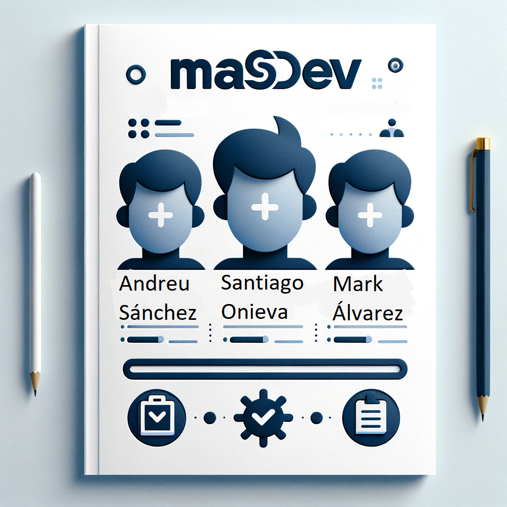
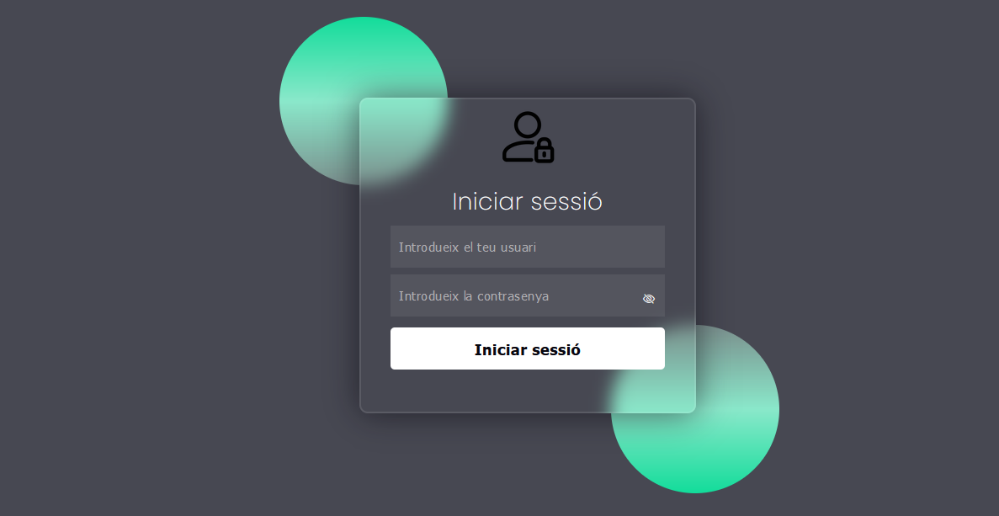

# Projecte ASIX WEBS 1

### Introducció
- [Context del Projecte](#context-del-projecte)
- [Descripció del projecte](#descripció-del-projecte)
- [Objectius del Projecte](#objectius-del-projecte)
- [Què és WordPress?](#què-és-wordpress)
- [Característiques Principals de WordPress](#característiques-principals-de-wordpress)
- [Avantatges i Desavantatges de WordPress](#avantatges-i-desavantatges-de-wordpress)

### Desenvolupament del Projecte.
- [Instal·lació](#installació)
- [Menú de navegació](#menú-de-navegació)
- [Gestió d'usuaris](#gestió-dusuaris)
- [Categories i Subcategories](#categories-i-subcategories)
- [Creació d'Articles i Pàgines](#creació-darticles-i-pàgines)
- [Selecció i Configuració de la Plantilla](#selecció-i-configuració-de-la-plantilla)
- [Instal·lació i Configuració de Plugins](#installació-i-configuració-de-plugins)
  - [Plugins per a Funcionalitats del Portal](#plugins-per-a-funcionalitats-del-portal)
  - [Plugins per a Gestió del CMS](#plugins-per-a-gestió-del-cms)
- [Multilingüisme al CMS](#multilingüisme-al-cms)

### Conclusions
- [Resultats Obtinguts](#resultats-obtinguts)
- [Problemes trobats i solucions](#problemes-trobats-i-solucions)
- [Potencials Millores Futures](#potencials-millores-futures)
- [Conclusió final](#conclusió-final)

   

# Introducció

## Context del Projecte

Un centre educatiu ha contractat els serveis de la nostra empresa, MASDEV, per desenvolupar una solució digital que millori la gestió dels professors. Aquesta solució té com a objectiu optimitzar els processos de registre, validació i gestió de les dades personals dels professors. El centre educatiu busca una eina eficient, segura i fàcil d'utilitzar per facilitar aquestes tasques administratives, permetent als conserges gestionar de manera efectiva els professors i garantint la seguretat de la informació.

## Descripció del projecte

El projecte consisteix en una aplicació web que permet al conserge loguejar-se , introduir professors, enviar correus electrònics de validació als professors automàticament, i gestionar les dades personals dels professors de manera segura i eficient.

## Objectius del Projecte

- Facilitar la gestió dels professors per part del conserge.
- Automatitzar el procés de registre i validació dels professors.
- Assegurar la seguretat i privacitat de les dades personals dels professors.
- Millorar l'eficiència administrativa del centre educatiu.

## Què és el nostre projecte?

És una aplicació web dissenyada per gestionar el registre i la validació dels professors, així com per recopilar i emmagatzemar les seves dades personals de manera segura.

## Tecnologies Usades

En aquest projecte hem utilitzat les següents tecnologies:

- **HTML** --> Per a la creació de les pàgines web. HTML (HyperText Markup Language) és el llenguatge estàndard utilitzat per estructurar el contingut d'una pàgina web.
- **CSS** --> Per al disseny i estilització de les pàgines web. CSS (Cascading Style Sheets) s'utilitza per definir l'estil i el disseny de les pàgines HTML.
- **PHP** --> Per al desenvolupament del backend de l'aplicació. PHP és un llenguatge de programació del servidor que permet crear pàgines web dinàmiques i interactives.
- **JavaScript (JS)** --> Per a la interactivitat i funcionalitat del client. JavaScript és un llenguatge de programació del costat del client que permet crear elements interactius dins d'una pàgina web.
- **SQL** --> Per a la gestió de la base de dades. SQL (Structured Query Language) s'utilitza per gestionar i manipular bases de dades.
- **Pila LAMP amb Apache** --> La infraestructura del servidor està basada en la pila LAMP, que inclou:
    - **Linux** --> És el sistema operatiu de base sobre el qual s'executa la resta de la pila LAMP. Linux és conegut per la seva estabilitat i seguretat.
    - **Apache** --> És el servidor web que serveix les pàgines web als usuaris. Apache és un dels servidors web més utilitzats al món i és conegut per la seva fiabilitat i flexibilitat.
    - **MySQL** --> És el sistema de gestió de bases de dades que utilitzem per emmagatzemar les dades dels professors. MySQL és un sistema de bases de dades relacional molt popular per la seva eficiència i robustesa.
    - **PHP** --> És el llenguatge de programació del servidor que hem utilitzat per crear la lògica de la nostra aplicació web.

## Avantatges i Desavantatges

Avantatges:

- Automatització del procés de registre i validació, reduint la càrrega de treball manual per al conserge.
- Millora de la seguretat en la gestió de dades personals dels professors.
- Facilitat d'ús tant per al conserge com per als professors.
- Reducció dels errors humans en el procés de registre i validació gràcies a un control d'errors tant en el frontend com en el backend.

Desavantatges:

- Dependència del correu electrònic per a la validació, que pot ser un inconvenient si els professors tenen problemes d'accés als seus correus.
- Necessitat de mantenir la seguretat dels codis de validació per evitar accessos no autoritzats.

   

# Desenvolupament del Projecte

## Instal·lació i Configuració

La nostre aplicació està instal·lada en un Ubuntu Server (versió 22.04 LTS) utilitzant la pila LAMP (Linux, Apache, MySQL, PHP). Al següent enllaç es detalla el procés d'instal·lació: [Procés d'instal·lació](./LAMP.md)

## Estructura de Continguts i Dades

- **Login.php:** Aquesta pàgina és la interfície d'inici de sessió per als conserges del sistema de gestió de professors. Permet als usuaris autoritzats accedir al sistema introduint les seves credencials (usuari i contrasenya). El formulari està enllaçat amb un altre PHP anomenat validaciLogin.php on es comproven les dades introduides per el conserge. 
    - Enllaç on s'explica detalladament aquest fitxer: [login.php](./mas-files/login.php)
    
