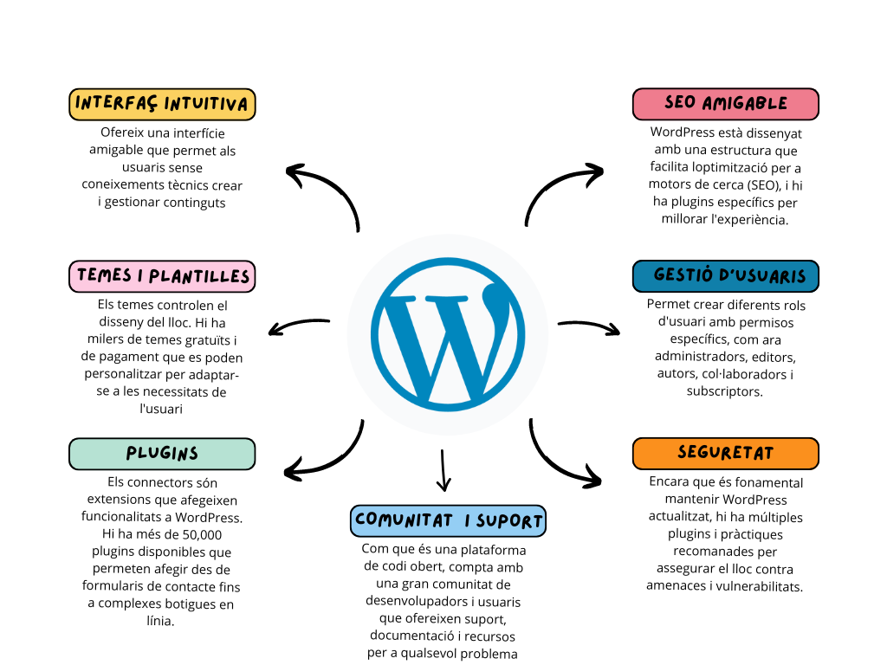
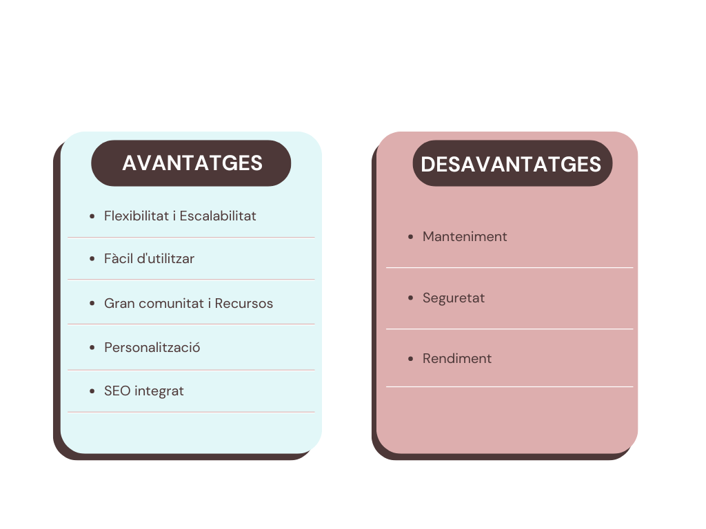

  

# Index

### Introducció.
- Context del Projecte
- Objectius del Projecte
- Descripció General de WordPress

### Desenvolupament del Projecte.
- Estructura de Continguts.
  - Categories i Subcategories
  - Creació d'Articles i Pàgines
- Configuració de Menús
- Gestió d'usuaris
- Selecció i Configuració de la Plantilla
- Instal·lació i Configuració de Plugins
  - Plugins per a Funcionalitats del Portal
  - Plugins per a Gestió del CMS
- Multilingüisme al CMS

### Explicació tècnica
- Detalls del Servidor i la Pila LAMP
  - hemos escogido ubuntu server porque noseke…
- Procediments d'instal·lació i configuració
  - Instalacion del proyecto.

### Conclusions
- Resultats Obtinguts
- Problemes trobats i solucions
- Potencials Millores Futures

### Annexos
- Codi Font (si s'aplica)
- Captures de Pantalla
- Documentació Addicional

  

# INTRODUCCIÓ.

## Context del projecte.

Aquest projecte es desenvolupa en el marc d'una col·laboració interna entre dos departaments clau de la nostra organització:

- El departament de Desenvolupament (MASDEV).
- El departament de maquinari i infraestructures (MASTECH). 

L'objectiu principal és crear una botiga online utilitzant WordPress, que permeti a MASTECH vendre els seus productes tecnològics de manera eficient i accessible.

## Descripció del projecte.

En aquest projecte, el departament MASDEV s'ha encarregat del disseny, el desenvolupament i la implementació d'una plataforma de comerç electrònic per al departament MASTECH. Aquesta botiga en línia està dissenyada per oferir una experiència d'usuari òptima, facilitant la navegació i la compra de productes de maquinari.

## Què és WordPress?

WordPress és un sistema de gestió de continguts (CMS) de codi obert que permet crear i gestionar llocs web de manera senzilla i eficient mitjançant l'ús de temes i plugins.

Hi ha dues versions principals:

- WordPress.org --> la versió autoallotjada.
- WordPress.com --> la versió allotjada per Automattic.

## Característiques principals de Wordpress

## Avantatges i desavantatges de Wordpress

  

# Desenvolupament del Projecte.

## Instal·lació
El nostre WordPress està instal·lat en un servidor Linux (versió 22.04 LTS) utilitzant la pila LAMP (Linux, Apache, MySQL, PHP).  Al següent enllaç es detalla el procés d'instal·lació: [Procés d'instal·lació](./instal·lacio.md)

## Estructura de continguts 

