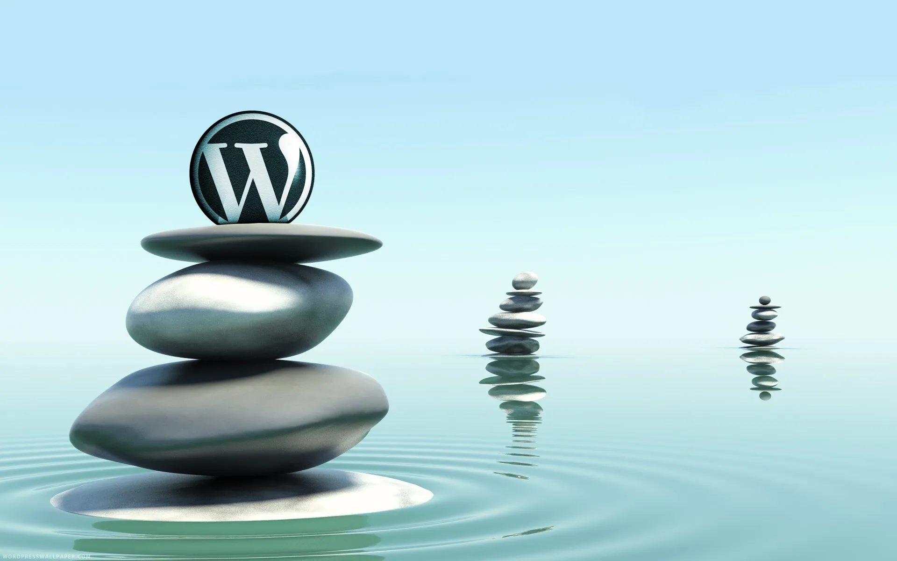

  

# Index

### Introducció.
- Context del Projecte
- Objectius del Projecte
- Descripció General de WordPress

### Desenvolupament del Projecte.
- Estructura de Continguts.
  - Categories i Subcategories
  - Creació d'Articles i Pàgines
- Configuració de Menús
- Gestió d'usuaris
- Selecció i Configuració de la Plantilla
- Instal·lació i Configuració de Plugins
  - Plugins per a Funcionalitats del Portal
  - Plugins per a Gestió del CMS
- Multilingüisme al CMS

### Explicació tècnica
- Detalls del Servidor i la Pila LAMP
  - hemos escogido ubuntu server porque noseke…
- Procediments d'instal·lació i configuració
  - Instalacion del proyecto.

### Conclusions
- Resultats Obtinguts
- Problemes trobats i solucions
- Potencials Millores Futures

### Annexos
- Codi Font (si s'aplica)
- Captures de Pantalla
- Documentació Addicional

  

# INTRODUCCIÓ.

### Context del projecte.