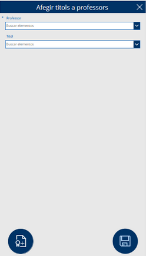

# Afegir titols a professors

Pantalla destinada a afegir títols als professors, que inclou un menú desplegable per seleccionar el professor i el títol corresponent. Com a totes les altres pàgines, disposa d'un botó per retrocedir que no tornarem a explicar. A més, compta amb un botó per afegir el títol seleccionat i un altre per guardar els canvis realitzats.

Botó d'afegir títol --> Canvia a la pantalla 'AfegirTitol' i inicialitza un nou formulari denominat 'FormAfegirTitol'.

