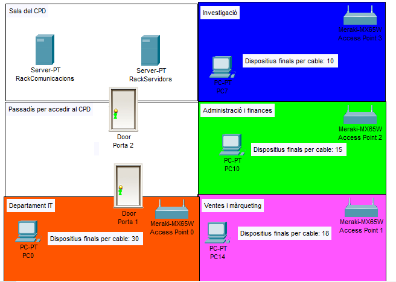
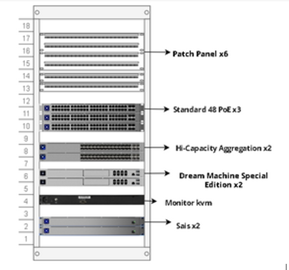

# Projecte CPD MAS

### Introducció
- [Context del projecte](#context-del-projecte)
- [Descripció del projecte](#descripció-del-projecte)
- [Components principals del projecte](#components-principals-del-projecte)
- [Beneficis esperats](#beneficis-esperats)

### Desenvolupament del Projecte

- [Anàlisi de l'empresa que ens ha contractat](#anàlisi-de-lempresa-que-ens-ha-contractat)
- [Distribució de l’empresa per sales](#distribució-de-lempresa-per-sales)
- [Comunicació entre racks](#comunicació-entre-racks)
  - [Què és Top of Rack (TOR)?](#què-és-top-of-rack-tor)
  - [Per què hem triat top of the rack?](#per-què-hem-triat-top-of-the-rack)
- [Distribució dels dispositius dintre del rack](#distribució-dels-dispositius-dintre-del-rack)
  - [Rack de comunicacions](#rack-de-comunicacions)
  - [Elecció de l'Equipament de Xarxa](#elecció-de-lequipament-de-xarxa)
  - [Raons per Escollir Ubiquiti](#raons-per-escollir-ubiquiti)
  - [Equipament Seleccionat](#equipament-seleccionat)
- [Esquema lògic de xarxa](#esquema-lògic-de-xarxa)

### Conclusions

### Fitxa Tècnica

   

# Introducció

## Context del Projecte

El departament MASTECH de la nostra empresa MAS, i EcoTech, ens hem reunit per discutir les millors opcions que beneficiïn les dues companyies. Durant la reunió, van deixar clar la seva disposició a invertir calitat/preu en un Centre de Processament de Dades (CPD).

Implementar un CPD proporcionaria a EcoTech una infraestructura tecnològica més sòlida, segura i escalable que respaldaria el seu creixement continu i el seu compromís amb la innovació i la sostenibilitat ambiental.

En resposta a les seves necessitats, hem presentat la proposta següent:

[Desenvolupament del projecte](#desenvolupament-del-projecte-1)

 

## Descripció del Projecte

El projecte de Centre de Processament de Dades (CPD) per a EcoTech consisteix en la planificació, instal·lació i configuració d'una infraestructura tecnològica robusta que pugui suportar el creixement continu de l'empresa. Aquest CPD està dissenyat per proporcionar una plataforma segura, fiable i escalable que permetrà a EcoTech gestionar les seves operacions de manera més eficient i innovadora.

 

## Components Principals del Projecte

1. Infraestructura Física:
    - **Sales de CPD:** Espai dedicat per allotjar el rack de servidors i el rack de comunicacions. També te allotjat dispositius de seguretat física.
    - **Racks i Dispositius:** Organització i distribució dels dispositius dins dels racks per optimitzar l'espai i la gestió del cablejat.

2. Xarxa i Comunicacions:
    - **Esquema de Xarxa:** Disseny d'un esquema de xarxa lògic i físic que asseguri la comunicació fluida i segura entre tots els dispositius.
    - **Switchos i Enrutadors/firewalls:** Utilització de switchos i enrutadors/firewalls que suportin protocols avançats com el RSTP (Rapid Spanning Tree Protocol) per evitar bucles de xarxa.

3. Seguretat i Fiabilitat:
    - **Seguretat Física:** Mesures per protegir físicament els equips, incloent controls d'accés i sistemes de vigilància.
    - **Seguretat de Xarxa:** Implementació de VLANs i altres mesures per segmentar la xarxa i protegir les dades sensibles.

4. Gestió de Dades:
    - **Servidors:** Utilització de servidors HP DL360 GEN10 amb tecnologia reacondicionada per garantir el rendiment i la fiabilitat.
    - **Virtualització:** Implementació de tecnologies de virtualització per optimitzar l'ús dels recursos del servidor.
    - **Emmagatzematge:** Utilització d'un NAS (Network Attached Storage) per a còpies de seguretat i gestió de dades.

5. Procediments de Backup:
    - **Automatització de Backups:** Configuració de scripts i cron jobs per realitzar còpies de seguretat diàries de les bases de dades i altres dades crítiques.
    - **Emmagatzematge de Backups:** Guardar còpies de seguretat en ubicacions segures per garantir la recuperació de dades en cas de fallada del sistema.

6. Escalabilitat i Creixement:
    - **Planificació per al Futur:** Disseny del CPD tenint en compte el creixement futur d'EcoTech, assegurant que la infraestructura pugui ser ampliada fàcilment.
    - **Tecnologies Innovadores:** Incorporació de tecnologies innovadores que suportin els objectius de sostenibilitat i eficiència d'EcoTech.

 

## Beneficis Esperats
    
- **Millora en la Gestió de Dades:** Una infraestructura més robusta i fiable permetrà a EcoTech gestionar les seves dades de manera més eficient.
- **Seguretat Avançada:** Les mesures de seguretat implementades protegiran les dades sensibles contra amenaces internes i externes.
- **Escalabilitat:** La infraestructura escalable assegura que el CPD pugui créixer juntament amb EcoTech, adaptant-se a les necessitats canviants de l'empresa.
- **Eficiència Operativa:** La virtualització i altres tecnologies innovadores milloraran l'eficiència operativa, permetent a EcoTech oferir millors serveis als seus clients.
- **Sostenibilitat:** Reducció de l'impacte ambiental gràcies a pràctiques sostenibles.
- **Alta disponibilitat:** Mínim temps d'inactivitat gràcies a una infraestructura fiable i sistemes de backup efectius.
- **Flexibilitat:** Capacitat d'adaptar-se ràpidament a les necessitats canviants del negoci.

   

# Desenvolupament del Projecte

## Anàlisi de l'empresa que ens ha contractat

"EcoTech" és una empresa ficticia que es dedica a la producció i comercialització de tecnologies ecològiques.

El seu enfocament principal radica en el desenvolupament i la venda de productes tecnològics dissenyats per promoure la sostenibilitat ambiental i l'eficiència energètica.

 

## Distribució de l’empresa per sales

Aquesta secció descriu com es distribueixen les diferents sales dins de l'empresa.

EcoTech ens ha deixat aquesta imatge com a referencia. És una imatge sencilla però clara d'entendre.

  

Segons aquesta distribució que ens ha facilitat l'empresa, podem extreure les següents conclusions:

1. Sala del CPD.
   - **Racks**:
     - 1 Rack de comunicacions.
     - 1 Rack de Servidors.
   - **Accés**:
     - Porta 2 connecta la Sala del CPD amb el Passadís per accedir al CPD.

2. Passadís per accedir al CPD.
   - Connecta la Sala del CPD amb la sala del departament d'IT mitjançant la Porta 2 i la Porta 1.

3. Departament d'investigació.
   - **Quantitat de dispositius finals per cable**: 
     - 10.
     - 1 d'aquestes 10 ips, està reservada per 1 **access point**.

4. Administració i Finances
   - **Quantitat de dispositius finals per cable**:
      - 15.
      - 1 d'aquestes 15 ips, està reservada per 1 **access point**.

5. Ventes i Màrqueting
   - **Quantitat de dispositius finals per cable**: 
     - 18
     - 1 d'aquestes 18 ips, està reservada per 1 **access point**.

6. Departament IT
   - **Quantitat de dispositius finals per cable**: 
     - 30.
     - 1 d'aquestes 30 ips, està reservada per 1 **access point**. 

**Resum General**
- **Total de dispositius finals per cable**:
  - Investigació: 10
  - Administració i Finances: 15
  - Ventes i Màrqueting: 18
  - Departament IT: 30
  - -------------------------------
    Total: 73 dispositius finals + 20 càmeres = 93 IPs per cable

- **Punts d'accés inalàmbric**:
  - Access Point 0 (Departament IT)
  - Access Point 1 (Ventes i Màrqueting)
  - Access Point 2 (Administració i Finances)
  - Access Point 3 (Investigació)

Aquesta distribució ajuda a visualitzar clarament la disposició de les sales, la ubicació dels servidors, els dispositius finals i els punts d'accés a l'empresa, facilitant la planificació per al muntatge del CPD.

Considerem que una sola sala és suficient per allotjar els nostres equips en aquest moment. Com que estem operant amb un nombre limitat de racks, no veiem la necessitat immediata d'expandir-nos a múltiples sales. Aquesta simplificació a la infraestructura ens permet optimitzar l'ús de l'espai i els recursos disponibles.

A més, en consolidar els racks en una sola sala, podem centrar els nostres esforços a enfortir la seguretat física d'aquest espai específic. Ens hem assegurat d'implementar mesures de seguretat robustes per protegir els equips i les dades que hi ha. Aquesta concentració ens permet maximitzar l'eficàcia de les nostres mesures de seguretat, cosa que inclou el control d'accés, la vigilància i la detecció d'intrusions.

La infraestructura del nostre CPD compta amb la comunicació entre racks ToR i un ampli espai a la sala, cosa que la fa completament escalable.

- Vídeo de la sala del CPD detalladament amb un model 3D fet amb ***Sweet Home 3D***

    [Clica per accedir per veure el vídeo](Enlace)

 

## Comunicació entre racks

En el nostre projecte de CPD, la comunicació entre racks és un aspecte crític per assegurar una xarxa eficient, fiable i escalable. Hem optat per una solució basada en la tecnologia Top of Rack (TOR) per gestionar aquesta comunicació. A continuació, es detallen els components i avantatges d'aquesta solució.

### Què és Top of Rack (TOR)?

La tecnologia TOR consisteix en col·locar un switch a la part superior de cada rack. Aquest switch connecta tots els dispositius dins del rack i després s'interconnecta amb els switches d'altres racks mitjançant connexions d'alta velocitat. Això crea una xarxa eficient i fàcil de gestionar.

### Per què hem triat top of the rack?

Hem optat per l'opció de comunicació entre racks Top of Rack (ToR) a causa dels seus avantatges significatius:

1. Eficàcia en la Gestió del Cablejat:
    - La solució ToR redueix la complexitat del cablejat dins del CPD. Amb els switchos situats a la part superior de cada rack, es redueix la longitud dels cables necessaris per connectar els dispositius dins del mateix rack. Això no només facilita la gestió del cablejat, sinó que també millora l'estètica i l'accessibilitat per a tasques de manteniment.

2. Escalabilitat:
    - La configuració ToR permet afegir nous racks i switchos fàcilment sense necessitat de realitzar una reconfiguració significativa de la xarxa existent. Aquesta flexibilitat és crucial per a un CPD que necessita créixer i adaptar-se a les necessitats canviants de l'empresa amb el temps.

3. Redundància i Fiabilitat:
    - Amb la solució ToR, cada rack pot tenir múltiples connexions a switchos centrals, oferint així redundància a nivell de xarxa. En cas de fallada d'un switch, el tràfic es pot redirigir a través d'altres camins disponibles, assegurant així la continuïtat del servei i minimitzant el temps d'inactivitat.

4. Rendiment Elevat:
    - Les connexions d'alta velocitat entre switchos ToR asseguren un ample de banda suficient per a les aplicacions més exigents. Això és especialment important per a aplicacions de dades intensives i serveis de virtualització, on la latència baixa i l'alt ample de banda són crítics.

5. Simplicitat en la Configuració i Gestió:
    - La configuració de switchos ToR és més senzilla comparada amb altres arquitectures de xarxa, ja que la major part del tràfic es maneja localment dins del rack. Això facilita la gestió de la xarxa, redueix el temps de configuració i minimitza els errors humans.

## Distribució dels dispositius dintre del rack

Apartat que detalla com es col·loquen els dispositius dins de cada rack per optimitzar l'espai, la refrigeració i l'accessibilitat per al manteniment.

### Rack de comunicacions

#### Elecció de l'Equipament de Xarxa

Ens hem decantat per la marca Ubiquiti per la seva excel·lent relació qualitat-preu i la seva reputació en oferir productes fiables i de rendiment superior. Hem treballat amb Ubiquiti en nombrosos projectes anteriors i sempre hem obtingut resultats excel·lents.

#### Raons per Escollir Ubiquiti
1. Qualitat i Fiabilitat:
    - Ubiquiti és reconeguda per produir equipament de xarxa d'alta qualitat que ofereix una fiabilitat excepcional. La seva gamma de productes està dissenyada per suportar les exigències de les infraestructures de xarxa modernes, garantint un rendiment consistent i durador.

2. Relació Qualitat-Preu:
   - Els productes d'Ubiquiti ofereixen una relació qualitat-preu molt competitiva. Aquesta marca proporciona solucions avançades a preus assequibles, permetent-nos maximitzar l'eficiència del pressupost sense comprometre la qualitat ni les funcionalitats.

3. Experiència Prèvia:
   - Hem treballat amb Ubiquiti en diversos projectes, i la nostra experiència ha estat consistentment positiva. Els seus productes han demostrat ser fàcils de configurar, gestionar i mantenir, oferint un alt nivell de satisfacció als nostres clients.

#### Equipament Seleccionat
1. CloudGateway (Dream Machine Pro Max):
    - Hem seleccionat dos unitats de Ubiquiti Dream Machine Pro Max per realitzar les funcions de router i firewall. Aquest dispositiu integrat ofereix una combinació potent de funcionalitats de routing, seguretat i gestió de xarxa, adaptant-se perfectament a les necessitats del nostre CPD.
    2. Switchos Standard 48:
        - Hem seleccionat tres Ubiquiti Standard 48 per connectar els dispositius finals dins del CPD. Aquests switchos ofereixen una alta capacitat de ports i un rendiment consistent, fent-los ideals per gestionar una gran quantitat de connexions.
            - Alta Capacitat de Ports.
            - Velocitat Gigabit.
            - Compatibilitat amb PoE.
    3. Hi-Capacity Aggregation Switches:
        - Hem seleccionat dos Ubiquiti Hi-Capacity Aggregation Switches per connectar els switchos Standard 48 i els servidors mitjançant connexions de fibra òptica. Aquests switchos són essencials per agregar tràfic de múltiples switchos i proporcionar una ruta de dades d'alta velocitat.
    4. Monitor KVM amb Elevador
        - Per a la gestió centralitzada i el control dels servidors, hem seleccionat un monitor KVM (Keyboard, Video, Mouse) amb elevador. Aquest dispositiu permet l'accés i el control de múltiples servidors des d'un únic punt, facilitant les tasques d'administració i manteniment.
    5. Sistemes d'Alimentació Ininterrompuda (SAI).
        - Per garantir la continuïtat del servei i protegir els equips de possibles interrupcions elèctriques, hem inclòs dos Sistemes d'Alimentació Ininterrompuda (SAI) a la part inferior del rack. Aquests dispositius proporcionen una font d'alimentació segura i fiable en cas de fallades de subministrament elèctric.

 

## Esquema lògic de xarxa

Es presenta un esquema lògic de la xarxa que mostra com es connecten els dispositius dins del CPD.

### Model de 3 capes

Explicació del model de xarxa de 3 capes utilitzat, que inclou la capa d'accés, la capa de distribució i la capa de nucli.

### ISP Orange

Detalls sobre la connexió a internet a través del proveïdor ISP Orange.

### ISP Movistar

Detalls sobre la connexió a internet a través del proveïdor ISP Movistar.

## Organització de xarxa

### Evitar bucles amb RSTP

Com evitem els bucles que produeix la redundància a la xarxa mitjançant l'ús del protocol RSTP (Rapid Spanning Tree Protocol).

### Separació de la xarxa per subxarxes i VLANs

Descripció de com es divideix la xarxa en subxarxes i VLANs per als diferents departaments de l'empresa utilitzant 802.1Q VLAN Tagging.

## Servidors que fem servir

### Descripció del sistema

Tenim 3 servidors HP DL360 GEN10 8SFF № 140.E-5766 amb tecnologia reacondicionada. Aquests servidors es configuren en un cluster per optimitzar el rendiment i la disponibilitat dels serveis.

### Procediment de Backup

Detall del procediment automatitzat de còpies de seguretat diàries per garantir la integritat i disponibilitat de les dades.

## Seguretat del CPD

### Ubicació física del CPD

Detalls sobre la ubicació física del CPD i les mesures preses per protegir-lo.

### Accés a la sala del CPD

Mesures de control d'accés a la sala del CPD per garantir que només el personal autoritzat pugui accedir-hi.

### Seguretat física del CPD

Mesures de seguretat física implementades per protegir els equips dins del CPD.

   

# Conclusions

## Conclusió final

El projecte CPD MAS ha complert amb èxit els objectius plantejats, proporcionant una infraestructura robusta i segura per a l'empresa. Les mesures implementades asseguren la continuïtat del servei i la protecció de les dades.

   

# Fitxa Tècnica

**Nom del Projecte:** Projecte CPD MAS

**Empresa Desenvolupadora:** MASDEV

**Tecnologies Utilitzades:**
- **Servidors:** HP DL360 GEN10 8SFF
- **Switchos:** Amb suport per a RSTP
- **Protocol de xarxa:** 802.1Q VLAN Tagging
- **Programari de Virtualització:** Detall del programari utilitzat per gestionar els servidors virtualitzats
- **Sistemes de Backup:** NAS (Network Attached Storage)
- **Procediments de Backup:** Automatitzats amb cron jobs

**Descripció del Sistema:**
- **Infraestructura de Xarxa:** Model de 3 capes amb connexions a ISP Orange i ISP Movistar
- **Servidors:** Configurats en cluster per a alta disponibilitat i escalabilitat
- **Seguretat:** Implementació de mesures de seguretat física i lògica per protegir els equips i les dades

**Enllaços Relacionats:**
- [Detalls del Switch de Capa 3](enllaç-a-switch-capa-3)
- [Detalls del Switch de Capa 2](enllaç-a-switch-capa-2)
- [Captura de RSTP](enllaç-a-captura-rstp)
