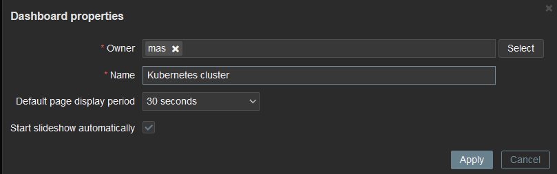
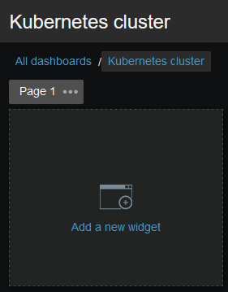

# Creacio de dashboards per centralitzar l'estat de les maquines

## Com crear un dashboard
Anem a `Monitoring -> Dashboard -> Create dashboard` amb les següents caracteristiques

- Prepietari: <usuari\>
- Nom: Kubernetes cluster

Ens redirigira a la pagina d'edicio del dashboard, on podrem donar clic a qualsevol lloc dins de l'area negra per afegir un widget

