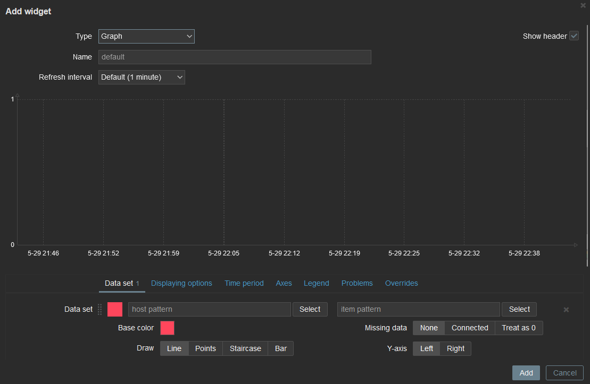
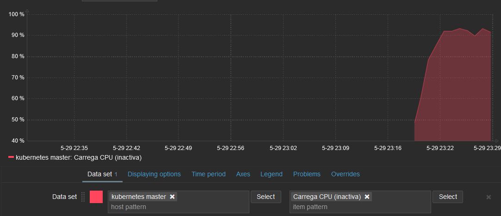
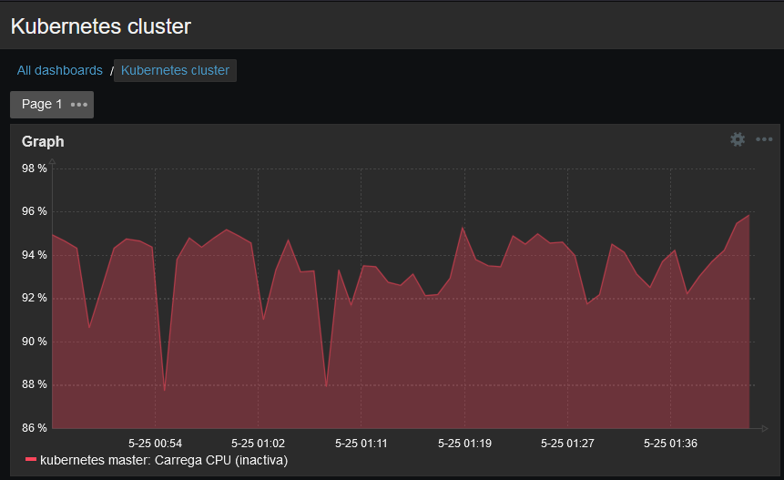

# Creacio de dashboards per centralitzar l'estat de les maquines

## Com crear un dashboard
Anem a `Monitoring -> Dashboard -> Create dashboard` amb les següents caracteristiques

- Prepietari: <usuari\>
- Nom: Kubernetes cluster

Ens redirigira a la pagina d'edicio del dashboard, on podrem donar clic a qualsevol lloc dins de l'area negra per afegir un widget

Si donem clic s'ens obrira la finestra de configuracio del widget, on podem configurar diferents parametres, sobretot el tipus, ja que determinara com sera el widget. En aquest cas crearem un gràfic.

Els parametres més importants en un gràfic son `host pattern` i `item pattern` ja que determinaran el host i l'item del host del que s'agafaran les dades per mostrar-les. Seleccionarem com a host `node master` i com a item `carrega de la CPU (inactiva)`. Una vegada seleccionats, es mostrará un exemple de com es veuran les dades.

Al finalitzar la creació, es mostrara el grafic al dashboard.

## Caracteristiques dels widgets del dashboard principal

### Widget 1
- Tipus: Disponiblitat dels hosts
- Grup de hosts: `Kubernetes cluster`
- Tipus d'interficie: Agent Zabbix

### Widget 2
- Tipus: Text pla
- Items: `kubernetes master: Estat pods`

### Widget 3
- Tipus: Rellotge
- Tipus temps: Temps local

### Widget 4
- Tipus: Problemes
- Mostra: Problemes
- Grup de hosts: `Kubernetes cluster`

### Widget 5
- Tipus: Valor d'item
- Item: `kubernetes master: Pods en estat "Running"`

### Widget 6
- Tipus: Valor d'item
- item: `kubernetes master: Estat API server`